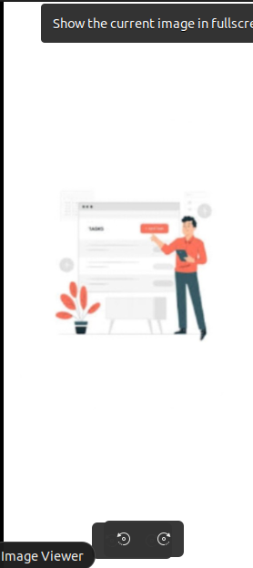
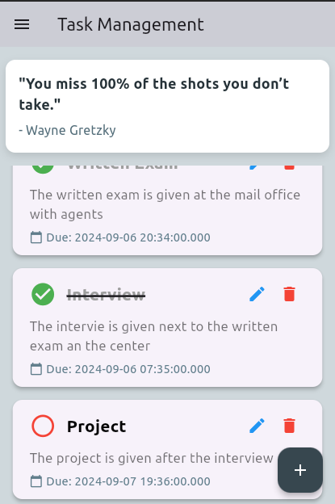
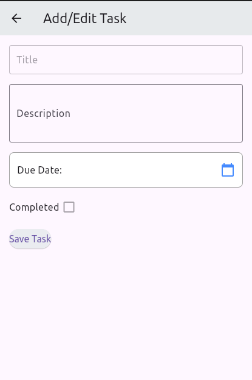
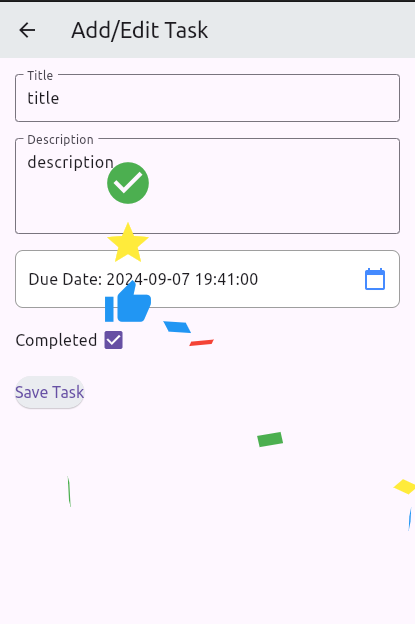
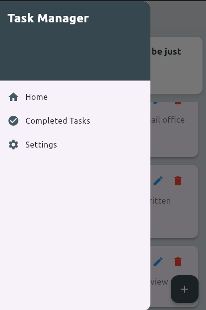
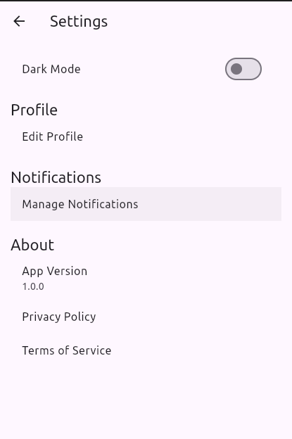
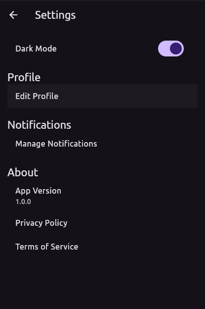

# Task Management App

A Flutter application designed to manage tasks, set due dates, and receive local notifications for tasks due soon.

## Features

- Add and edit tasks
- Set due dates with hours, minutes, and seconds
- Mark tasks as completed
- Receive local notifications for tasks due within 1 hour

## Dependencies

- **flutter**: The Flutter framework.
- **flutter_local_notifications**: For scheduling and displaying local notifications.
- **flutter_local_notifications_linux**: For Linux-specific notification support.
- **provider**: For state management.
- **confetti**: For celebrating task completion with confetti animations.

## Getting Started

### Prerequisites

- [Flutter](https://flutter.dev/docs/get-started/install) installed
- A compatible IDE such as [Visual Studio Code](https://code.visualstudio.com/) or [Android Studio](https://developer.android.com/studio)
- [Docker](https://www.docker.com/products/docker-desktop) (if using Docker for backend services)

### Setup
To run the project on android device
1. **Clone the Repository**

   ```bash
   git clone https://github.com/Sireat/task_management_app.git
   cd task_management_app
   flutter pub get 
   flutter run
Look some screenshoots










